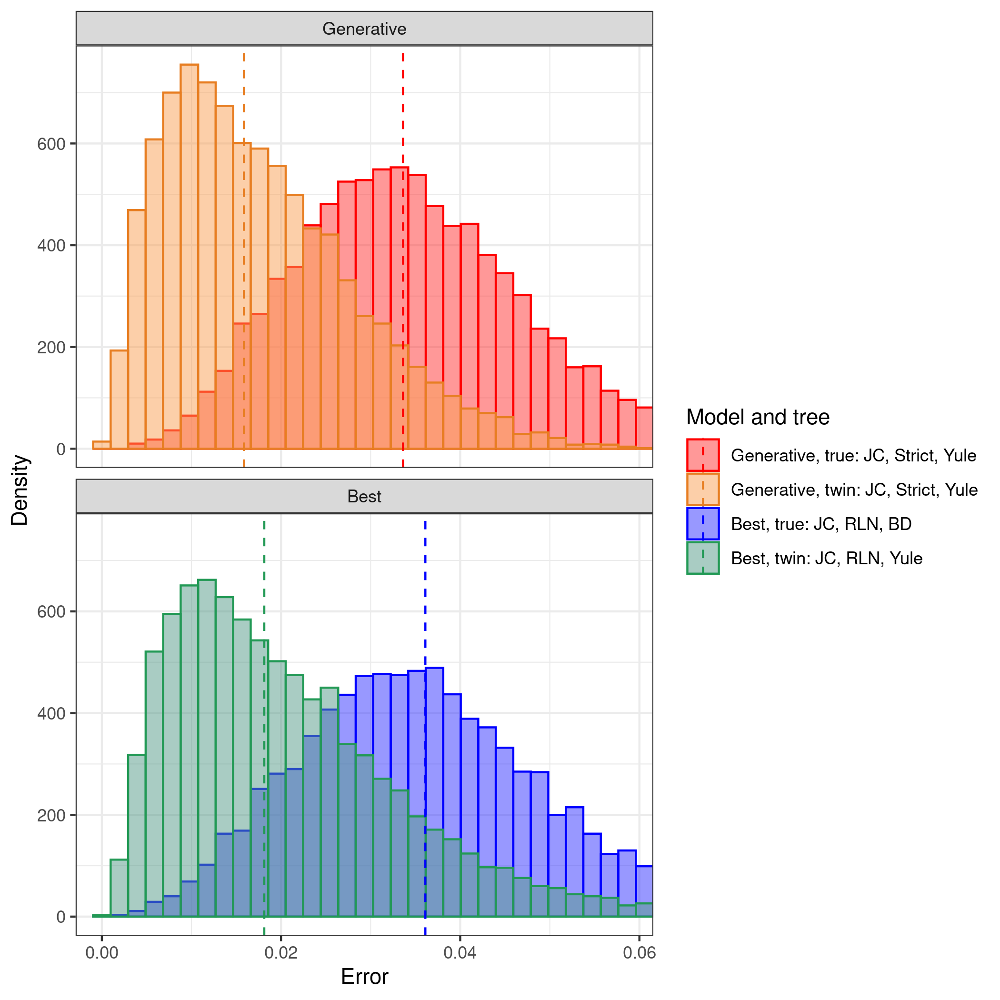

# pirouette_example_30

Branch   |[](https://travis-ci.org)                                                                                                 |[](https://appveyor.com)                                                                                               
---------|--------------------------------------------------------------------------------------------------------------------------------------------------------------|---------------------------------------------------------------------------------------------------------------------
`master` |[](https://travis-ci.org/richelbilderbeek/pirouette_example_30) |[](https://ci.appveyor.com/project/richelbilderbeek/pirouette-example-30/branch/master)
`develop`|[](https://travis-ci.org/richelbilderbeek/pirouette_example_30)|[](https://ci.appveyor.com/project/richelbilderbeek/pirouette-example-30/branch/develop)

A [pirouette example](https://github.com/richelbilderbeek/pirouette_examples):
use one exemplary DD tree, as used in the pirouette article.


## Running on Peregrine

Install `pirouette` using the [peregrine](https://github.com/richelbilderbeek/peregrine)
bash and R scripts.

Then, in the main folder of this repo, type:

```
sbatch scripts/rerun.sh
```

## Related settings

 * [Multiple DD trees](https://github.com/richelbilderbeek/pirouette_example_28)

## Results

 * Download the intermediate data at 
   [https://www.richelbilderbeek.nl/pirouette_example_30.zip](https://www.richelbilderbeek.nl/pirouette_example_30.zip)



